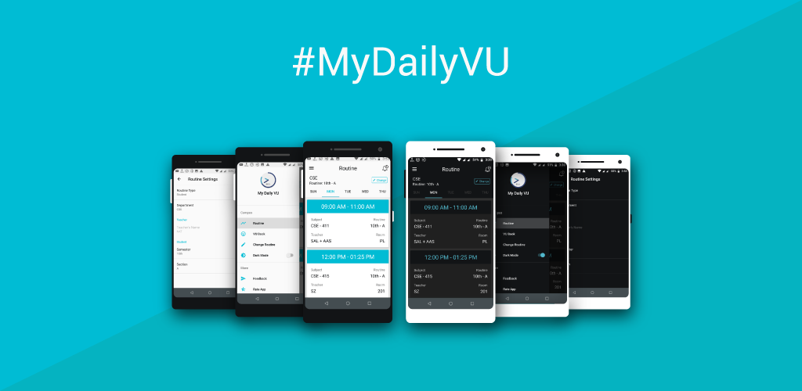

# MyDailyVU

 

      
   

## About

My Daily VU was my first project ever. It it a class routine application for my university, Varendra University, CSE Department.
It had nearly 1000 downloads, unfortunately my first goole play console got terminated.

## Tools

- UI - XML
- Language - Java
- Database - Firebase Firestore, Firebase Authentication
- Graphics - Adobe Illustrator
- Version Support - Android 6 to Android 10

## White-Space

The application is live on Google Play Store.
Click on the link to download the application!  
https://play.google.com/store/apps/details?id=com.whitespace.my_daily_vu
